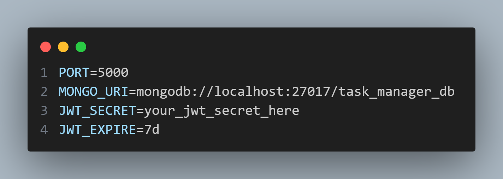
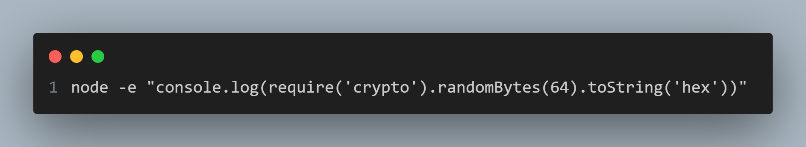
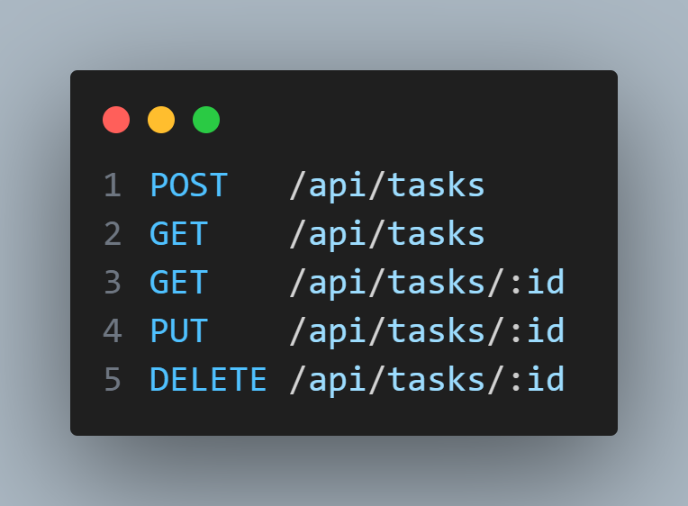

<br>

# 🚀 QUICK SETUP

## 🔹 1. BACKEND

### ✅ Prerequisites

* Node.js (v16 or higher recommended)
* MongoDB (local or cloud)
* Git installed

---

### ✅ Setup & Run

#### 1️⃣ Clone the repository

```bash
git clone https://github.com/Satyaamp/task-manager
cd task-manager
```

#### 2️⃣ Install backend dependencies

```bash
cd backend
npm install
```

#### 3️⃣ Setup environment variables

Create the `.env` file using the example:

```bash
cp .env.example .env
```

* Example:

  

* Create a strong JWT secret:

  

👉 Update all required values inside the `.env` file.

---

#### 4️⃣ Start the server

```bash
npm run dev
```

✅ Backend runs at:

```
http://localhost:5000
```

---

### ✅ Using the APIs

1. Register a user → `POST /api/auth/register`
2. Login → `POST /api/auth/login`
3. Copy the JWT token
4. Use the token in request headers:

```
Authorization: Bearer <JWT_TOKEN>
```

---

### ✅ Endpoints

**Auth Routes**


---

5️⃣ Access Task APIs:

```
/api/tasks
```

**Task APIs (CRUD)**



---

### ✅ Notes

* Authentication is required for all Task APIs
* Passwords are securely stored using **bcrypt**
* Unauthorized requests are blocked

---

 This project demonstrates **clean backend architecture, authentication and security best practices**.

---

<br>


# 🔹 2. FRONTEND


### ✅ Prerequisites

* Modern browser (Chrome recommended)
* A local development server (Python, VS Code Live Server, or Node `serve`)
* Backend running at:

  ```
  http://localhost:5000
  ```

---

### 1️⃣ Navigate to the frontend folder

```bash
cd frontend
```

---

### 2️⃣ Start the frontend server

#### **Option A — Python HTTP Server**

```bash
python -m http.server 3000
```

Access in browser:

```
http://localhost:3000
```

#### **Option B — VS Code Live Server**

Right-click **index.html** → **Open with Live Server**

#### **Option C — Node Static Server**

```bash
npm install -g serve
serve -s .
```

---

### 3️⃣ Frontend Features

* Modern **glassy UI**
* Fully responsive using **Flexbox**
* Login & Register pages
* Dashboard with task analytics
* Task CRUD (Create, Read, Update, Delete)
* API integration via Fetch + JWT
* Full **PWA support** (installable app)
* Offline caching with Service Worker

---

### 4️⃣ Required Backend Connection

Frontend communicates with:

```
http://localhost:5000/api
```

Backend **must be running first** for:

* Login
* Signup
* Task operations
* Dashboard stats

---

### 5️⃣ PWA Setup

Included files:

* `manifest.json`
* `service-worker.js`
* App icons (72px → 512px)

Installable on:

* Android
* Desktop Chrome
* Windows

---

### 6️⃣ Important Notes

* Do **NOT** open HTML files directly (file://)
  → PWA + Fetch API will NOT work
* Always run using **localhost server**
* Clear service worker cache if UI changes:
  DevTools → Application → Service Workers → **Unregister**

---

<br>

## 👥 Developer

<table align="center">
  <tr>
    <td align="center">
      <br>
      <strong>Satyam Kumar</strong><br>
      <a href="https://github.com/Satyaamp">@Satyaamp</a>
    </td>
  </tr>
</table>

---

<div align="center">

### ⭐ Built with clean code, security & scalability in mind

</div>

---


