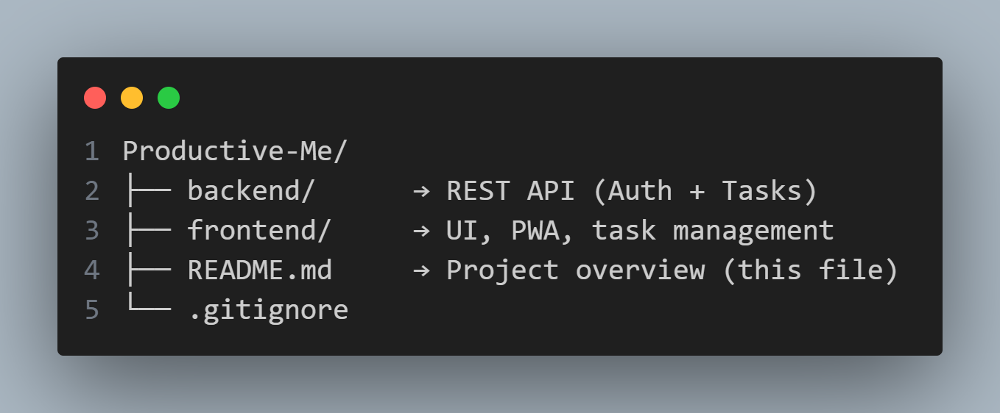

#  **PRODUCTIVE ME**

### A Modern, Productive, Full-Stack Task Manager App

#### *Fast • Responsive • Secure • PWA-Ready*

<div align="center">


*A sleek task manager built with modern UI, secure APIs and PWA capabilities.*

</div>

---

# ✨ **Overview**

**Productive Me** is a full-stack task management application designed for efficiency, clean UI and real-world development standards.
It features:

* ✔ Secure backend with authentication
* ✔ Modern frontend with glassy UI
* ✔ Full CRUD task operations
* ✔ User-specific dashboards
* ✔ Progressive Web App support
* ✔ Installable on desktop + mobile
* ✔ Fully responsive
* ✔ Clean folder structure

---

# 🧰 **Tech Stack (Full Project)**

| Layer              | Technology                        |
| ------------------ | --------------------------------- |
| **Frontend**       | HTML, CSS (Glassy UI), JavaScript |
| **Backend**        | Node.js, Express.js               |
| **Database**       | MongoDB + Mongoose                |
| **Authentication** | JWT (JSON Web Tokens)             |
| **Security**       | bcrypt, rate limiting             |
| **PWA**            | Service Worker, Manifest.json     |
| **Tools**          | VS Code, Postman, Git             |

---

# 🗂️ **Project Architecture**




---

# 🚀 **Quick Setup**

## 🔹 1. Backend Setup

```bash
cd backend
npm install
npm run dev
```

Backend runs at:

```
http://localhost:5000
```

> Configure `.env` using `.env.example` before running.

---

## 🔹 2. Frontend Setup

```bash
cd frontend
python -m http.server 3000
```

Frontend runs at:

```
http://localhost:3000
```

> Must run via **localhost**, not file://
> Backend must be running for login / tasks.

---

# 🔑 **Key Features**

### 🔐 Authentication

* Secure login + register
* JWT-based protected routes
* Rate-limited login

### 📝 Task Management

* Create, view, update, delete tasks
* Priority + status management
* User-specific task separation

### 📊 Dashboard

* Total tasks
* Completed vs pending
* Quick navigation

### 🎨 Modern UI

* Purple glassmorphism theme
* Responsive flexbox layout
* Smooth cards + components

### 📱 PWA Capabilities

* Installable on device
* App icons (72–512 px)
* Offline caching

---

# 📄 **Documentation**

| Component       | Documentation                            |
| --------------- | ---------------------------------------- |
| **Backend API** | [backend/backend.md](backend/backend.md)   |
| **Frontend UI** | [frontend/frontend.md](frontend/frontend.md) |
| **Quick Setup** | [QuickSetup.md](QuickSetup.md)   |

---

# 👨‍💻 **Developer**

<div align="center">

<br>

### **Satyam Kumar**

🔗 GitHub: [@Satyaamp](https://github.com/Satyaamp)

</div>

---

<div align="center">

### ⭐ *Built with passion and productivity*

</div>
