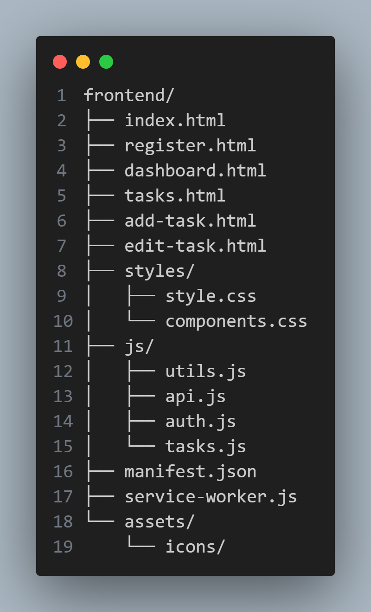
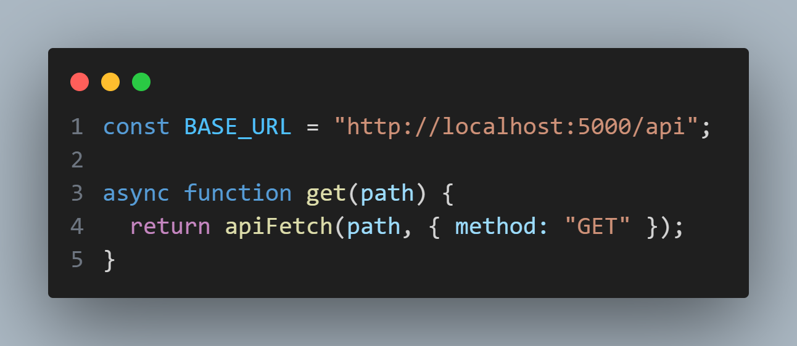

<br>

<div align="center">

# Frontend

### Modern UI • Responsive • PWA Enabled


A complete **HTML/CSS/JavaScript frontend** featuring
**glassy UI**, **flexbox responsive layouts**, **API integration** and **PWA offline support**.

</div>

---

## 📌 Project Overview

### 🎯 Task Objective

Build a **modern, responsive and user-friendly frontend** that connects to the **ProductiveMe** backend and provides:

* Clean and attractive UI
* Fully responsive layout
* CRUD UI for tasks
* JWT-protected views
* PWA installability
* API-driven dynamic pages

### ✅ What This Frontend Delivers

✔ Modern glassmorphism UI
✔ Responsive Flexbox layout
✔ Secure login & signup pages
✔ Task listing, editing, deleting
✔ Dashboard analytics (charts + progress)
✔ PWA offline support
✔ Smooth API integration with backend
✔ Clean modular code structure

---

## 🛠 Tech Stack

| Layer             | Technology                     |
| ----------------- | ------------------------------ |
| UI Structure      | HTML5                          |
| Styling           | CSS3 (Flexbox, Glassmorphism)  |
| Logic             | JavaScript (ES6 Modules)       |
| API Communication | Fetch API + JWT                |
| PWA               | Service Worker + manifest.json |
| Tools             | VS Code, Live Server           |

---

## 🧩 Frontend Architecture




*Fully modular structure: separate UI, logic, API helpers and PWA files.*

---

## 🎨 UI/UX Design

### ✨ Features Included

✔ **Glassy card UI**
✔ **Purple gradient theme**
✔ **Modern dashboard with progress ring**
✔ **Responsive layout using flexbox**
✔ **Modal-based delete confirmation**
✔ **Smooth hover and transition effects**

### 🖼 UI Screenshots

> *(Add your own screenshots for better submission)*

* Login Page
* Register Page
* Dashboard Page
* Tasks List
* Add/Edit Task Screens

Example placeholder:


---

## 🔗 API Integration

The frontend communicates with backend using:

### 📡 Fetch API + JWT Token

All API calls go through a clean wrapper in `api.js`:




---

### 🔐 Authentication Flow

* User logs in → token saved in localStorage
* Protected pages call `ensureAuth()`
* Token attached to all API requests
* Logout clears token

---

## 📌 Pages & Features

### 1️⃣ **Login (index.html)**

* Email + password
* Error handling
* Auto-token save
* Redirect on success

### 2️⃣ **Register (register.html)**

* Name, email, password
* Validations
* Auto-login after register

### 3️⃣ **Dashboard (dashboard.html)**

* Total tasks
* Completed tasks
* Pending tasks
* Circular progress indicator
* Quick action buttons


---

### 4️⃣ **Tasks List (tasks.html)**

* Fetch all tasks
* Display glass cards
* Edit/Delete options
* Delete modal
* Priority badges


---

### 5️⃣ **Add Task (add-task.html)**

* Form-based task creation
* Validations
* Redirect to task list

### 6️⃣ **Edit Task (edit-task.html)**

* Pre-filled input fields
* Update & save functionality

---

## 📱 PWA Support (Installable App)

This frontend supports full PWA functionality:

### Included:

✔ `manifest.json`
✔ App icons (72–512px)
✔ Service worker
✔ Offline fallback
✔ Installable banner

### 📱 App Icons (All Sizes)

| Size      | File                               | Preview |
|-----------|-------------------------------------|---------|
| **72×72**   | assets/icons/icon-72.png            |  |
| **96×96**   | assets/icons/icon-96.png            |  |
| **128×128** | assets/icons/icon-128.png           |  |
| **144×144** | assets/icons/icon-144.png           |  |
| **192×192** | assets/icons/icon-192.png           |  |
| **256×256** | assets/icons/icon-256.png           |  |
| **384×384** | assets/icons/icon-384.png           |  |
| **512×512** | assets/icons/icon-512.png           |  |

Installable on:

* Android
* Windows
* Desktop Chrome

---

## 🚀 Run Frontend Locally

### 1️⃣ Start backend first

```
npm run dev
```

Backend runs at:

```
http://localhost:5000
```

### 2️⃣ Start frontend server

Inside `/frontend` folder:

#### Option A — Python (recommended)

```bash
python -m http.server 3000
```

Open:

```
http://localhost:3000
```

#### Option B — VSCode Live Server

Right click → **Open with Live Server**

---

## ⚠ Common Issues & Fixes

| Issue             | Reason                         | Fix                             |
| ----------------- | ------------------------------ | ------------------------------- |
| Login fails       | Backend not running            | Start backend on port 5000      |
| Token missing     | No login performed             | Ensure login first              |
| Favicon missing   | Service worker cached old file | Unregister SW + hard reload     |
| Icons not loading | Wrong path                     | Place icons in `/assets/icons/` |

---

## 👥 Developer

<table align="center">
  <tr>
    <td align="center">
      <br>
      <strong>Satyam Kumar</strong><br>
      <a href="https://github.com/Satyaamp">@Satyaamp</a>
    </td>
  </tr>
</table>

---

<div align="center">

### ⭐ Built with clean UI, responsiveness & PWA excellence

</div>

---
